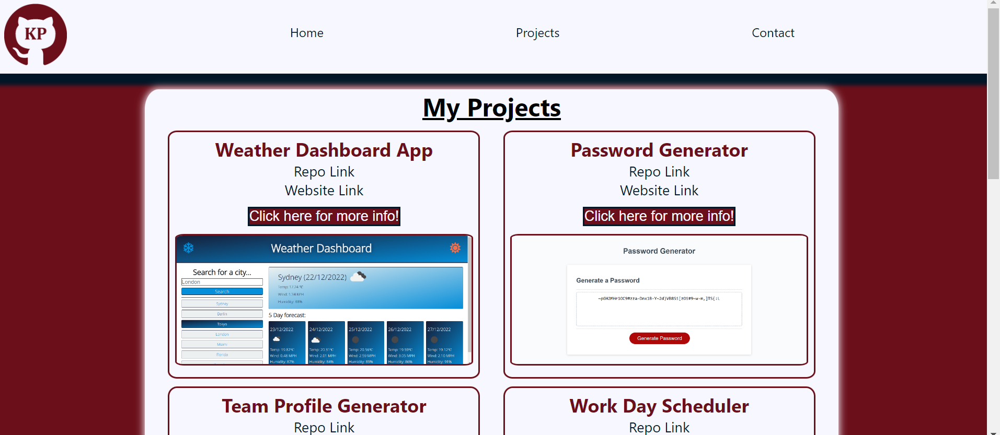

# React Portfolio

---

## Description

This repository is for my very own portfolio made with React. In this portfolio i have a brief description on me where i cover the skills i have attained. Also there is a projects page and Contact page. The projects page shows some of the projects i have worked on and can display some info about them. The Contact tab can be used to get in touch with me.

The technologies used to build this are: HTML, CSS, JavaScript, React, npm, Git

---

### Screenshot of completed site

The following image shows the web application's appearance

## License

MIT

---

## Website Link

The link to the website is:

[React Portfolio](https://britishcryptoguy.github.io/React-Portfolio/)

## Questions

In order to reach out for questions and feedback please use the following:

Github link: [BritishCryptoGuy](https://github.com/BritishCryptoGuy)

Resume link: [Resume](https://docs.google.com/document/d/11whHWES63WwTastXr4Rp6LfrGu3tLgujjfrEpd2smMs/edit?usp=sharing)

Email adress: Kieran_parkinson@hotmail.com
